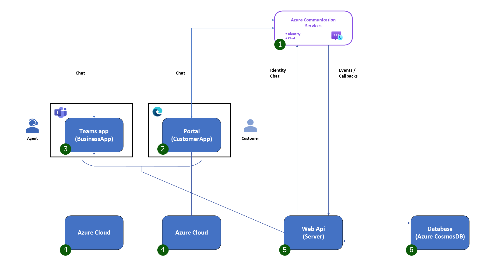
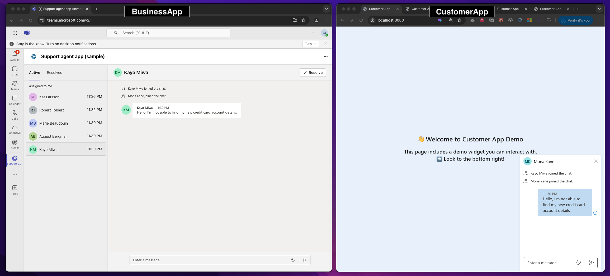

# B2C Customer-Agent Messaging Teams App

## Overview

This is a sample application to show how we can build a custom [Teams App](https://docs.microsoft.com/microsoftteams/platform/overview#build-apps-with-microsoft-teams-platform) that can interface with an Azure Communication Services instance, enabling the two systems to work together while keeping their backend environments and identity configurations separate.

This sample includes three standalone applications: CustomerApp, BusinessApp, and Server. Together, they provide a comprehensive customer support experience. The overall view of the system is shown below:


1. An Azure Communication Services instance that enables the chat experience.
2. **CustomerApp**: A web application used by customers to interact with agents. Users of this CustomerApp will be assigned Azure Communication Services identities.
3. **BusinessApp**: A web application hosted within a custom Teams application and deployed to Teams through an iframe inside the Teams client. Agents utilize this app within their Teams client.
   - This app leverages Teams’ Single Sign-On (SSO) to retrieve the Teams user ID.
   - The Azure Communication Services instance is not directly connected to the Teams environment. [Identity mapping](https://learn.microsoft.com/azure/communication-services/concepts/identity-model#user-identity--mapping) is required to connect the BusinessApp users who have a Teams user ID, to the CustomerApp users' Azure Communication Services identities.
   - For this sample app, an Azure Communication Services identity needs to be manually created for each BusinessApp user, then store the identity mapping in the environment variables ([steps are shown below in the AgentUsers section](https://github.com/Azure-Samples/communication-services-messaging-teams-app?tab=readme-ov-file#before-running-the-sample-for-the-first-time)).
   - Once the linkage is set, the BusinessApp will use the Teams user ID to map to the Azure Communication Services ID, then use that ID to retrieve threads and communicate with CustomerApp users.
4. **Azure Cloud**: Where the CustomerApp and the BusinessApp are hosted.
5. **Server** app: A web API that provides the necessary server-side functionality for the BusinessApp and the CustomerApp.
6. **Database**: An Azure Cosmos database to store metadata related to chat threads, such as their status.

## Key Features



- **Seamless Chat Start**: Customers can easily initiate a conversation by entering their name and question, instantly connecting with a random available agent.
- **Integrated Agent Interface**: Agents manage and respond to customer messages directly within the Microsoft Teams environment.
- **Effortless Conversation Management**: Agents can handle multiple customer conversations simultaneously and resolve them when complete. Resolved chats are moved to a separate tab, and customers are notified that the conversation has ended.
- **Chat Continuity**: Customers can resume conversations at any time simply by sending a new message, reactivating the chat.
- **Easy Exit for Customers**: Customers can exit the chat anytime, which revokes their access and informs the agent of their departure. Agents are instantly notified with a toast message showing which customer has exited, keeping them informed in real-time.

## Prerequisites

- [Visual Studio Code (Stable Build)](https://code.visualstudio.com/Download).
- [Node.js](https://nodejs.org/), supported versions: 20 | 22.
- Create an Azure account with an active subscription. For details, see [Create an account for free](https://azure.microsoft.com/free/?WT.mc_id=A261C142F).
- Create an Azure Communication Services resource. For details, see [Create an Azure Communication Resource](https://docs.microsoft.com/azure/communication-services/quickstarts/create-communication-resource). You'll need to record your resource **connection string** for this sample app.
- Create an Azure Cosmos DB for NoSQL account. For details, see [Create an Azure Cosmos DB account](https://docs.microsoft.com/azure/cosmos-db/nosql/tutorial-nodejs-web-app#create-account). You'll need to record the **URI** and **PRIMARY KEY** for this sample app.
- A [Microsoft 365 account for development](https://docs.microsoft.com/microsoftteams/platform/toolkit/accounts).
- [Set up your dev environment for extending Teams apps across Microsoft 365](https://aka.ms/teamsfx-m365-apps-prerequisites).
  Please note that after you enrolled your developer tenant in Office 365 Target Release, it may take couple days for the enrollment to take effect.
- [Teams Toolkit Visual Studio Code Extension](https://aka.ms/teams-toolkit) version 5.0.0 and higher or [Teams Toolkit CLI](https://aka.ms/teamsfx-toolkit-cli).

## Code structure

- [BusinessApp](./BusinessApp) - A custom Teams app for agents to provide customer support

  - [/index.tsx](./BusinessApp/src/index.tsx) - Entry point of this app
  - [/src](./BusinessApp/src) - The source code for the frontend of the Teams custom application
  - [/.vscode](./BusinessApp/.vscode) - VSCode files for debugging
  - [/appPackage](./BusinessApp/appPackage) - Teams application manifest
  - [/env](./BusinessApp/env) - Environment files
  - [/infra](./BusinessApp/env) - files for provisioning Azure resources
    The following are Teams Toolkit specific project files. You can [visit a complete guide on Github](https://github.com/OfficeDev/TeamsFx/wiki/Teams-Toolkit-Visual-Studio-Code-v5-Guide#overview) to understand how Teams Toolkit works
  - [/teamsapp.yml](./BusinessApp/teamsapp.yml) - This is the main Teams Toolkit project file. The project file defines two primary things: Properties and configuration Stage
  - [/teamsapp.local.yml](./BusinessApp/teamsapp.local.yml) - This overrides `teamsapp.yml` with actions that enable local execution and debugging
  - [/aad.manifest.json](./BusinessApp/aad.manifest.json) - This file defines the configuration of Microsoft Entra app. This template will only provision [single tenant](https://learn.microsoft.com/azure/active-directory/develop/single-and-multi-tenant-apps#who-can-sign-in-to-your-app) Microsoft Entra app

- [CustomerApp](./CustomerApp) - A web app where customers can start an Azure Communication Services chat without a Microsoft Teams account
  - [/index.tsx](./CustomerApp/src/index.tsx) - Entry point of this app
- [Server](./Server) - A server app that supports the BusinessApp and the CustomerApp
  - [/app.ts](./Server/src/app.ts) - Entry point of this app
  - [/appsettings.json.sample](./Server/appsettings.json.sample) - The sample file for all the environment variables needed to run the Server app

## Before running the sample for the first time

1. Open an instance of PowerShell, Windows Terminal, Command Prompt, or equivalent, and navigate to the directory that you'd like to clone the sample to and clone the repo.

   ```shell
   git clone https://github.com/Azure-Samples/communication-services-messaging-teams-app.git
   ```

1. Copy `Server/appsettings.json.sample` and remove the `.sample` extension.
1. Fill in the following variables in the newly created `Server/appsettings.json` file:
   1. **ResourceConnectionString**: Use the `Connection String` from the Azure portal. For more information on connection strings, see [Create an Azure Communication Resources](https://docs.microsoft.com/azure/communication-services/quickstarts/create-communication-resource).
   1. **EndpointUrl**: Use the `Endpoint` from the Azure portal. For more information on endpoint strings, see [Create an Azure Communication Resources](https://docs.microsoft.com/azure/communication-services/quickstarts/create-communication-resource).
   1. **AdminUserId**: Create a new Azure Communication Services user as a server user to add new users to the chat thread. You can get this value by clicking on `Identities & User Access Tokens` in Azure portal. Generate a user with `Chat` scope. Then use the `Identity` value for this variable. For more information on identity strings, see [Create and manage access tokens](https://docs.microsoft.com/azure/communication-services/quickstarts/identity/access-tokens).
   1. **CosmosDBEndpoint**: Use the `URI` value from the Azure portal's Cosmos DB account. For more information on Azure Cosmos DB account, see [Create an Azure Cosmos DB account](https://docs.microsoft.com/azure/cosmos-db/nosql/tutorial-nodejs-web-app#create-account).
   1. **CosmosDBKey**: Use the `PRIMARY KEY` value from the Azure portal's Cosmos DB account. For more information on Azure Cosmos DB account, see [Create an Azure Cosmos DB account](https://docs.microsoft.com/azure/cosmos-db/nosql/tutorial-nodejs-web-app#create-account).
   1. **AgentUsers**: An array of agent users that can use the BusinessApp. Each agent user object should contain the following values:
      1. **teamsUserId**:
         1. Login to the Azure portal tenant that you want to build the BusinessApp with (The same Microsoft 365 account should be used for the [Start the BusinessApp](https://github.com/Azure-Samples/communication-services-messaging-teams-app?tab=readme-ov-file#local-run)) step below.
         1. Use the `Object ID` from the Azure portal. For more information on user's object Id, see [Find the user object ID](https://docs.microsoft.com/partner-center/account-settings/find-ids-and-domain-names#find-the-user-object-id).
      1. **acsUserId**: Each agent should be linked to an Azure Communication Services user. The BusinessApp will use this credential to retrieve chat threads data and to communicate with customers in the Azure Communication Services environment.
         You can get this value by clicking on `Identities & User Access Tokens` in Azure portal. Generate a user with `Chat` scope. Then use the `Identity` value for this variable. For more information on identity strings, see [Create and manage access tokens](https://docs.microsoft.com/azure/communication-services/quickstarts/identity/access-tokens).
      1. **displayName**: Assign a display name for this agent.

## Local run

1. Start the CustomerApp

   ```bash
   cd CustomerApp && npm install && npm start
   ```

   This will open a client server on port 3000 that serves the website files.
   <br>

1. Start the Server app

   ```bash
   cd Server && npm install && npm run start:dev
   ```

   This will start an api server on port 8080 that performs functionality like minting tokens for chat participants and storing the chat thread.
   <br>

1. Start the BusinessApp

   1. Open a new VS Code instance with `BusinessApp` as the **top level folder**.
   1. Select the Teams Toolkit icon on the left in the VS Code toolbar.
   1. In the Account section, sign in with your [Microsoft 365 account](https://docs.microsoft.com/microsoftteams/platform/toolkit/accounts) if you haven't already.
   1. Press F5 to start debugging which launches your app in Teams using a web browser. Select `Debug in Teams (Edge)` or `Debug in Teams (Chrome)`.
   1. When Teams launches in the browser, select the `Add` button in the dialog to install the BusinessApp to Teams.

   This will open a browser window with the BusinessApp running inside Teams web client.

## Deploy

1. Preparation for deployment:
   1. Prepare the `App manifest` and `App icons`. For details, see [Teams app package](https://docs.microsoft.com/microsoftteams/platform/concepts/build-and-test/apps-package).
   1. Edit app `Basic information`, `App features`, `Permissions` etc. through Developer Portal. For details, see [To update Manifest file and app package](https://docs.microsoft.com/microsoftteams/platform/toolkit/publish-your-teams-apps-using-developer-portal#to-update-manifest-file-and-app-package).
1. Deploy the BusinessApp:
   `BusinessApp` is a Teams App. You can deploy the BusinessApp following [this instruction](https://learn.microsoft.com/microsoftteams/platform/toolkit/deploy) and publish it either [using Teams Toolkit](https://docs.microsoft.com/microsoftteams/platform/toolkit/publish) or [using Developer Portal](https://docs.microsoft.com/microsoftteams/platform/toolkit/publish-your-teams-apps-using-developer-portal).
1. Deploy the CustomerApp:
   `CustomerApp` is a React app. You can host it with a hosting provider such as [Azure Static Web Apps](https://docs.microsoft.com/azure/static-web-apps/overview). For details, see [Deploy your web app to Azure Static Web Apps
   ](https://docs.microsoft.com/azure/static-web-apps/deploy-web-framework?tabs=bash&pivots=react).
1. Deploy the Server app:
   `Server` app is a Node.js app. You can host it with a hosting provider such as Azure App Service. For details, see [Deploy a Node.js web app in Azure](https://docs.microsoft.com/azure/app-service/quickstart-nodejs?tabs=linux&pivots=development-environment-vscode).

## Add additional features:

- File sharing: To enable the file sharing feature, please follow this [quickstart](https://docs.microsoft.com/samples/azure-samples/communication-services-javascript-quickstarts/ui-library-sample---file-sharing-using-ui-components/) as an example.

## Additional Reading

- [Embed chat in a Microsoft Teams custom app](https://learn.microsoft.com/azure/communication-services/tutorials/chat-app-teams-embed)
- [Azure Communication Services - UI Library](https://azure.github.io/communication-ui-library/) - To learn more about what the `@azure/communication-react` package offers.
- [Azure Communication Chat SDK](https://azuresdkdocs.blob.core.windows.net/$web/javascript/azure-communication-chat/1.0.0-beta.3/index.html) - To learn more about the chat web sdk
- [Add or manage the environment](https://learn.microsoft.com/microsoftteams/platform/toolkit/teamsfx-multi-env)
- [Create multi-capability app](https://learn.microsoft.com/microsoftteams/platform/toolkit/add-capability)
- [Use an existing Microsoft Entra application](https://learn.microsoft.com/microsoftteams/platform/toolkit/use-existing-aad-app)
- [Customize the Teams app manifest](https://learn.microsoft.com/microsoftteams/platform/toolkit/teamsfx-preview-and-customize-app-manifest)
- Host your app in Azure by [provision cloud resources](https://learn.microsoft.com/microsoftteams/platform/toolkit/provision) and [deploy the code to cloud](https://learn.microsoft.com/microsoftteams/platform/toolkit/deploy)
- [Collaborate on app development](https://learn.microsoft.com/microsoftteams/platform/toolkit/teamsfx-collaboration)
- [Set up the CI/CD pipeline](https://learn.microsoft.com/microsoftteams/platform/toolkit/use-cicd-template)
- [Enable the app for multi-tenant](https://github.com/OfficeDev/TeamsFx/wiki/Multi-tenancy-Support-for-Azure-AD-app)
- [Preview the app on mobile clients](https://aka.ms/teamsfx-mobile)

## Telemetry

The B2C Customer-Agent Messaging Teams App collects usage data and sends it to Microsoft to help improve our products and services. Read our [Privacy Statement](https://go.microsoft.com/fwlink/?LinkId=521839) and [Data Collection Notice](https://docs.opensource.microsoft.com/content/releasing/telemetry.html) to learn more. Learn more in our [FAQ](https://code.visualstudio.com/docs/supporting/faq#_how-to-disable-telemetry-reporting).

## Trademarks

This project may contain trademarks or logos for projects, products, or services. Authorized use of Microsoft
trademarks or logos is subject to and must follow
[Microsoft's Trademark & Brand Guidelines](https://www.microsoft.com/legal/intellectualproperty/trademarks/usage/general).
Use of Microsoft trademarks or logos in modified versions of this project must not cause confusion or imply Microsoft sponsorship.
Any use of third-party trademarks or logos are subject to those third-party's policies.
